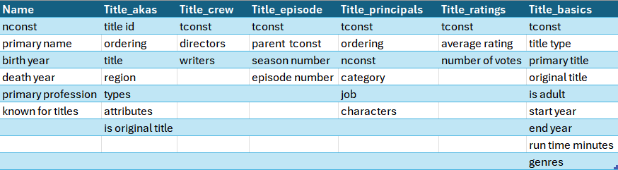
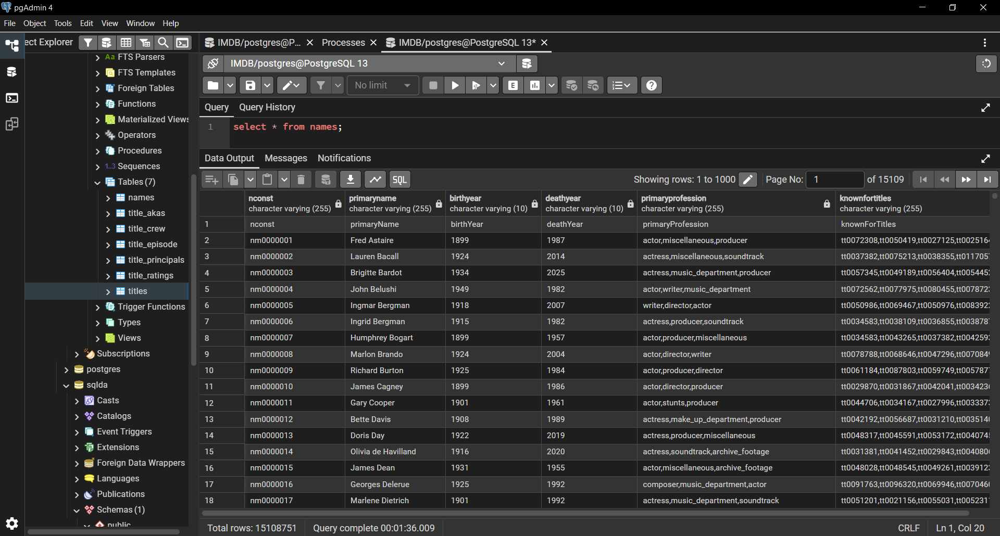
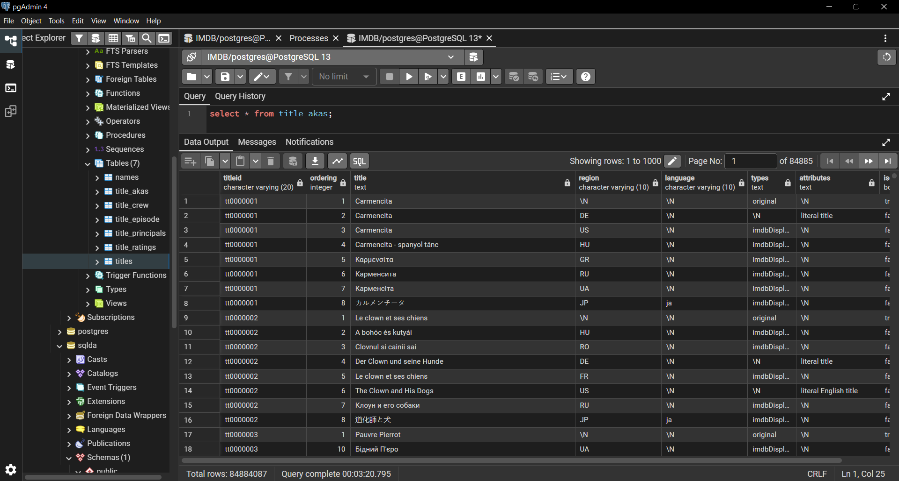
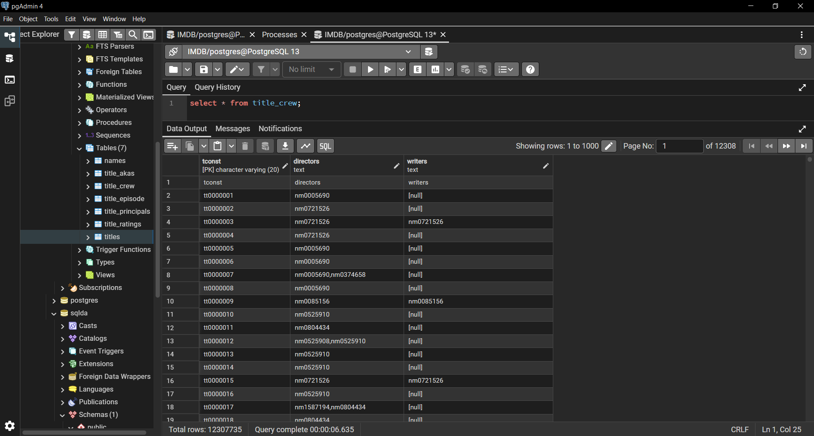
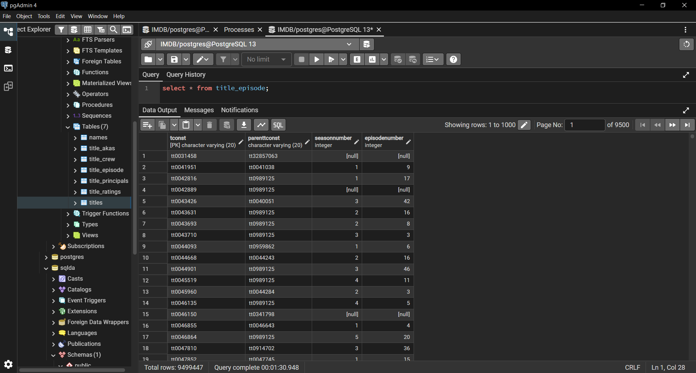
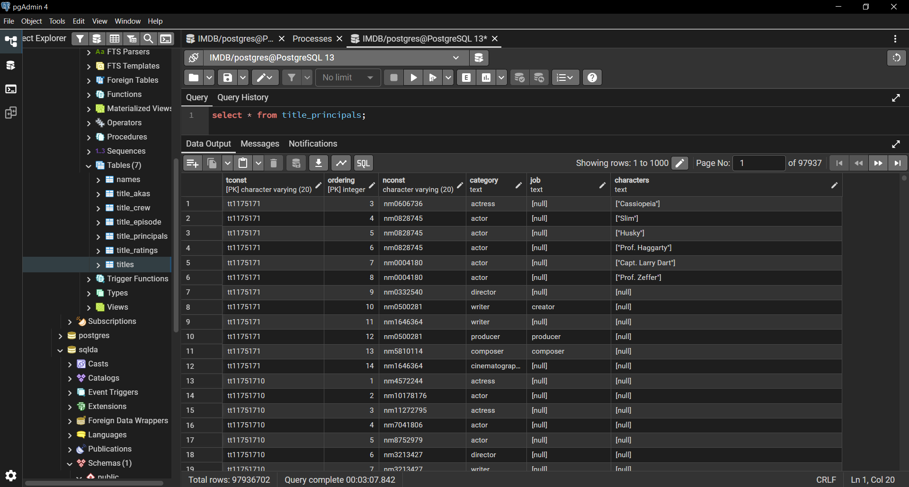
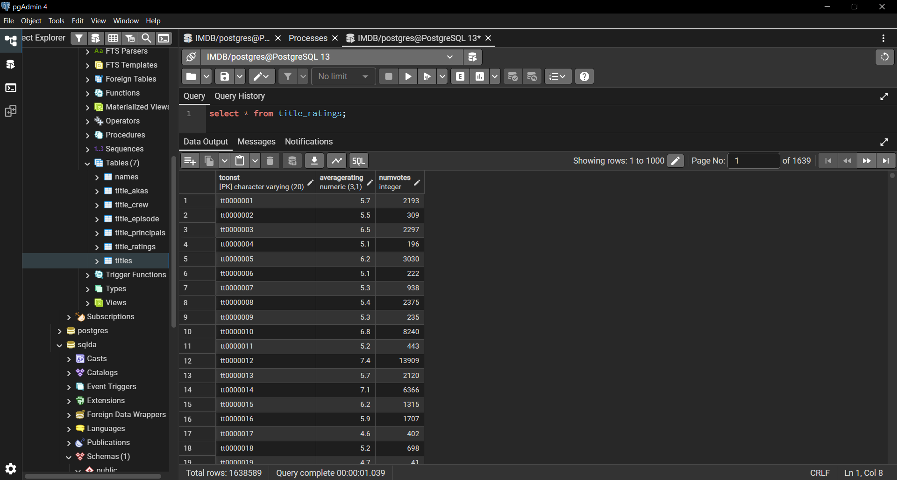
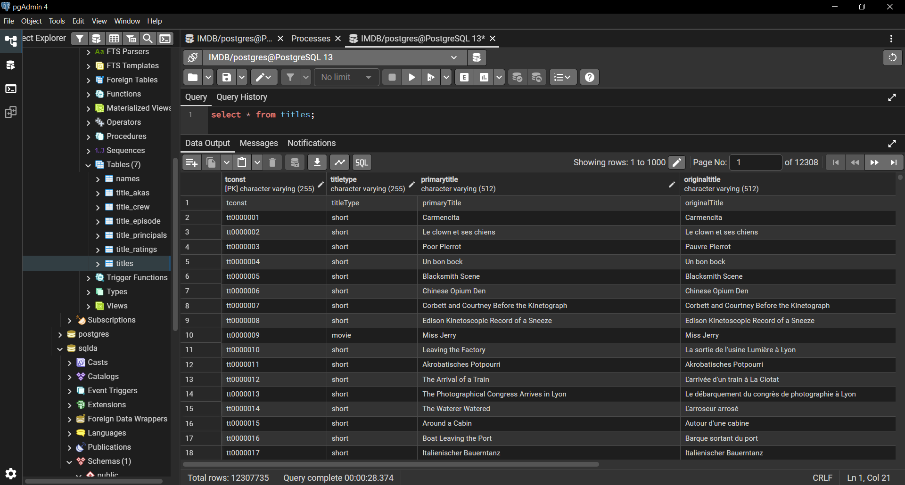
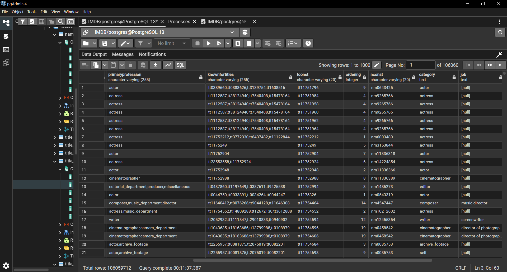

# Module 07: Final Project

- Name: Megan Chastain
- Course: Database for Analytics
- Module: 7
- Database Used:IMDB

## The initial data source
 - IMDB movie data from the IMDB website

## The format of your data, include count of column and rows.
 - 7 total tables
 - - Table 1: Names
      6 columns
      15108751 rows
 -  - Table 2: Title_akas
      8 columns
     84884087 rows
 - - Table 3: Title_crew
      3 columns
      12307735
 - - Table 4: Title_episode
      4 columns
      9499447 rows
- - Table 5: Title_Principals
      6 columns
      97936702 rows
- - Table 6: Title_ratings
      3 columns
      163589 rows
- - Table 7: Title_basics
      9 columns
      12307735 rows
## Show a data dictionary - a table describing each data attribute/feature/column.

## Describe some of the obstacles you overcame to transform the data.
- This project was pretty difficult, at least to load the data into the dataset. I had to navigate syntax errors from postgres when my headers didn't match the data type.

# Show your table structure including data types
- - sql code:
CREATE TABLE IF NOT EXISTS title_basics (
tconst         TEXT PRIMARY KEY,
title_type     TEXT,
primary_title  TEXT,
original_title TEXT,
is_adult       BOOLEAN,
start_year     INTEGER,
end_year       INTEGER,
runtime_minutes INTEGER,
genres         TEXT[]
);

I followed this schema for all tables, but used their columns and data types.
- -
Select * from each of your tables

## Show some interesting queries from your tables.  Include:
At least one join

- - sql code:
select * from names
Left outer join
title_principals on names.nconst = title_principals.nconst;
- -

## At least one query where you group by and aggregate data
- - sql code:
select averagerating, count(*)
from title_ratings
Group by
averagerating
- -
  [Number of films in each rating category](Screenshots/07_count_groupby.PNG)
