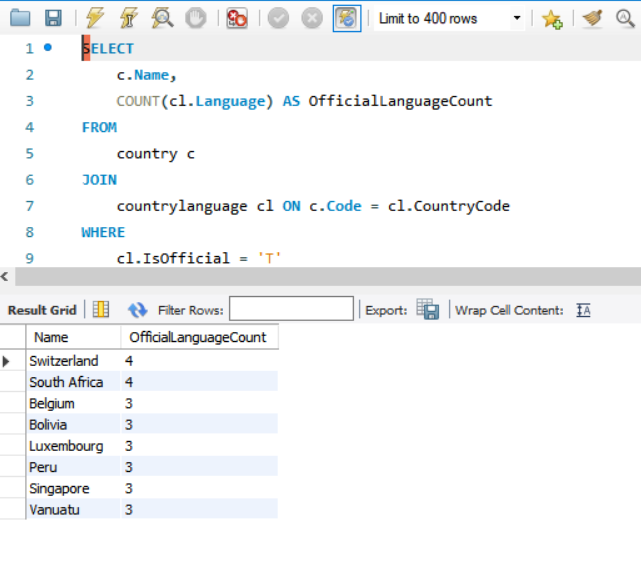
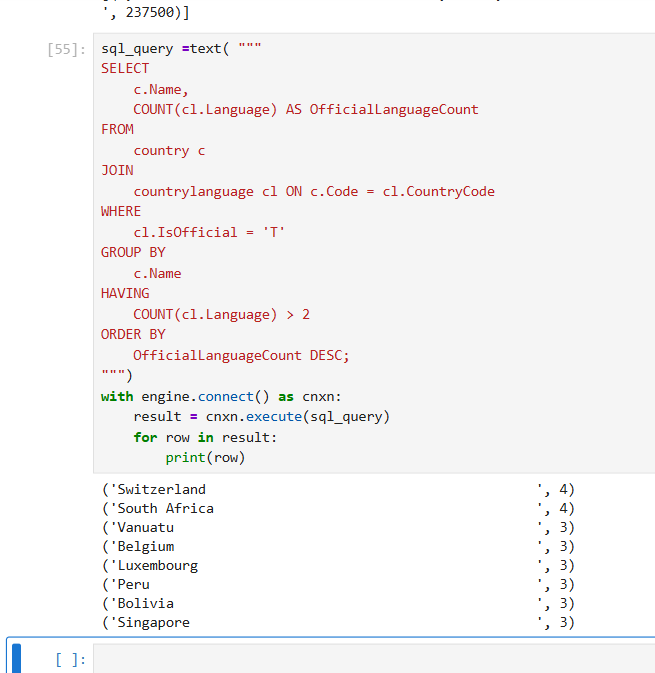
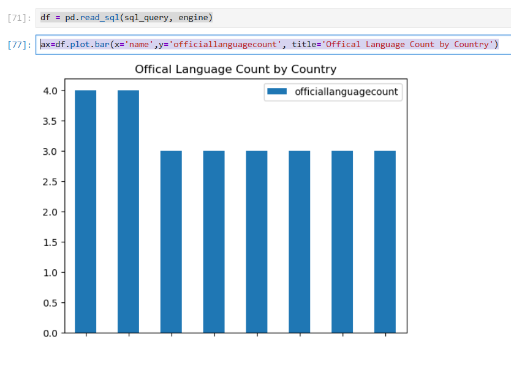

# Exercise 04: Advanced SQL, Jupyter, and Visualization

- Name: Megan Chastain
- Course: Database for Analytics
- Module: 04
- Database Used: World Database
- Tools Used: PostgreSQL, SQLAlchemy, Pandas, Jupyter Notebooks

---

## Instructions

- Complete each task using the **World database** installed earlier.
- For SQL questions:
  - Write the SQL command in a fenced code block
  - Execute the command and include a **screenshot of the results**
- For Jupyter Notebook questions:
  - Include the required Python statements
  - Include **screenshots of the notebook output**
- Store all screenshots in the `screenshots/` folder and embed them below each question.

---

## Question 1

Considering the World database, write a SQL statement that will **display the names of countries that speak more than two official languages**, along with the **number of official languages spoken**.

- Sort the results by **number of languages**, from **most to least**.
- *Hint: There are fewer than 10 countries in the results.*

### SQL

```sql
[SELECT
    c.Name,
    COUNT(cl.Language) AS OfficialLanguageCount
FROM
    country c
JOIN
    countrylanguage cl ON c.Code = cl.CountryCode
WHERE
    cl.IsOfficial = 'T'
GROUP BY
    c.Name
HAVING
    COUNT(cl.Language) > 2
ORDER BY
    OfficialLanguageCount DESC;]
```

### Screenshot



---

## Question 2

Using **Jupyter Notebooks**, you must use the `create_engine` command to connect to your database.

After the `create_engine` command is executed, **what are the three statements required to execute the query from Question 1 and display the results in the notebook**?

### Python Code

```python
sql_query =text( """
SELECT
    c.Name,
    COUNT(cl.Language) AS OfficialLanguageCount
FROM
    country c
JOIN
    countrylanguage cl ON c.Code = cl.CountryCode
WHERE
    cl.IsOfficial = 'T'
GROUP BY
    c.Name
HAVING
    COUNT(cl.Language) > 2
ORDER BY
    OfficialLanguageCount DESC;
""")
with engine.connect() as cnxn:
    result = cnxn.execute(sql_query)
    for row in result:
        print(row)
```

### Screenshot



---

## Question 3

Using **Jupyter Notebooks**, write the Python code needed to produce the following graph:


(The graph shows country-level results derived from the World database.)

### Python Code

```python
df = pd.read_sql(sql_query, engine)
ax=df.plot.bar(x='name',y='officiallanguagecount', title='Offical Language Count by Country')
```

### Screenshot


