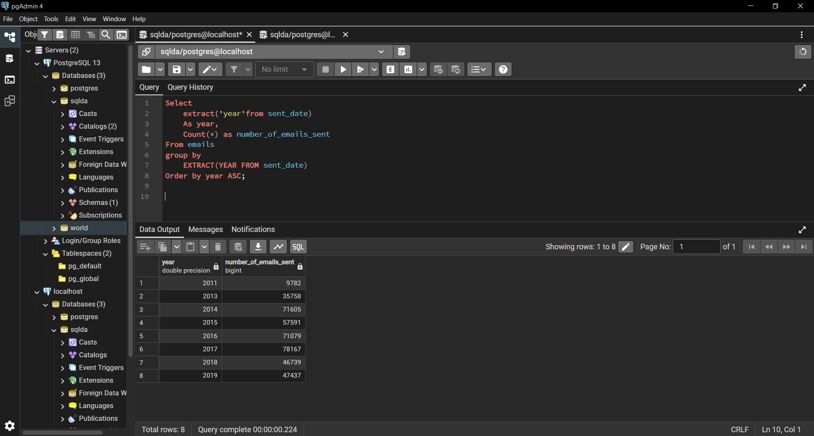
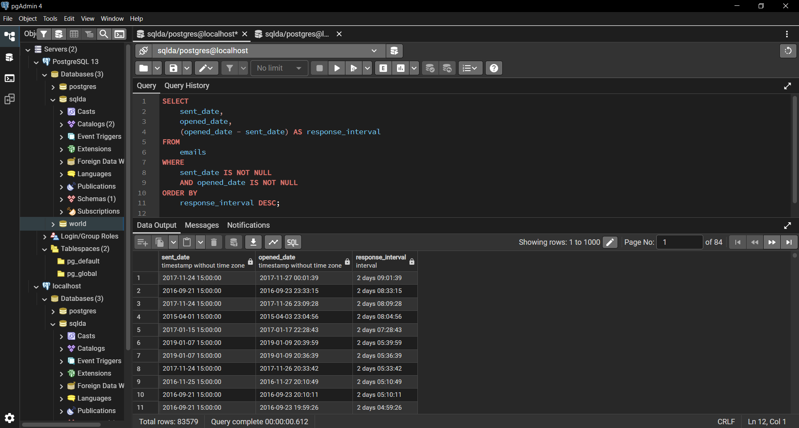
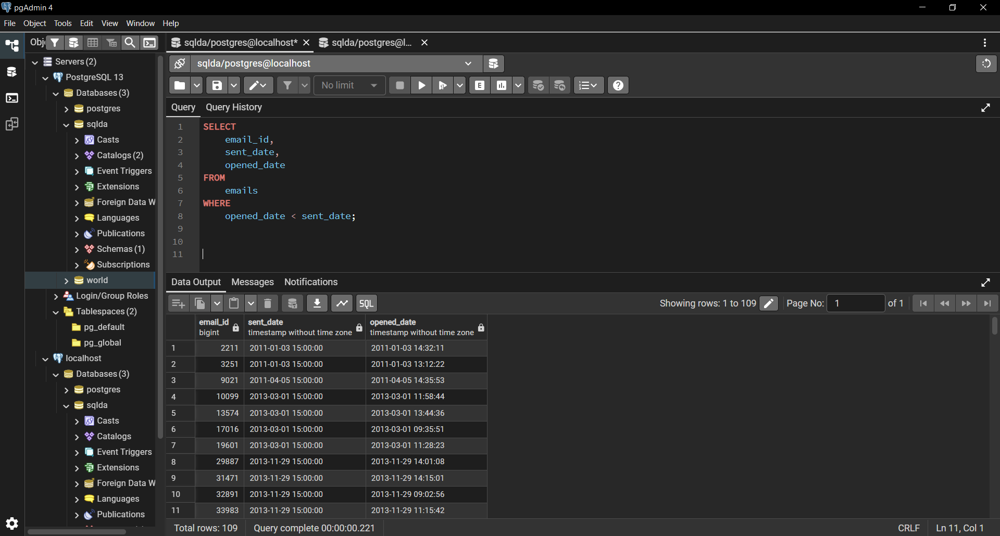
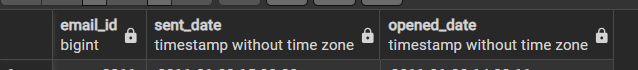
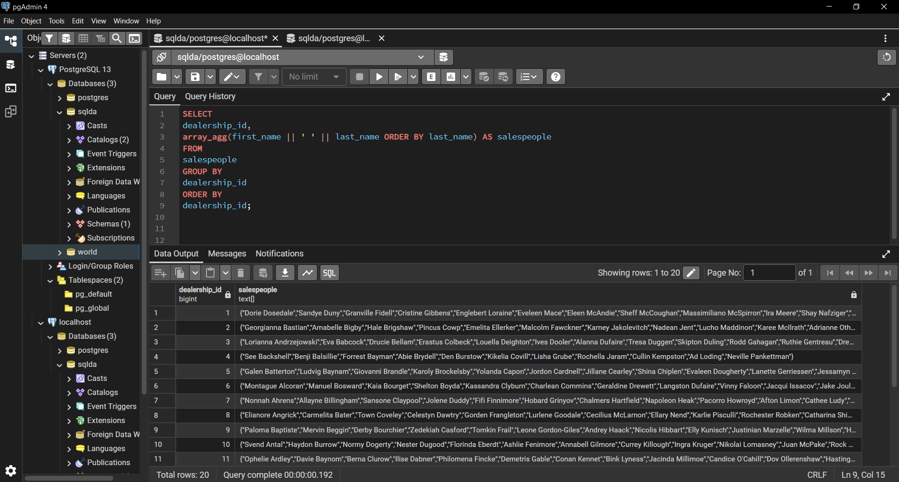
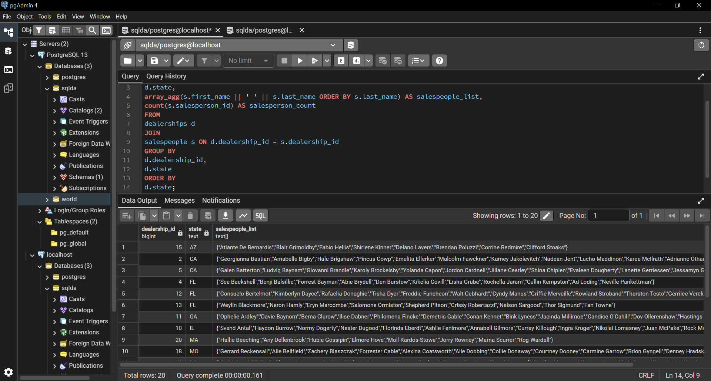
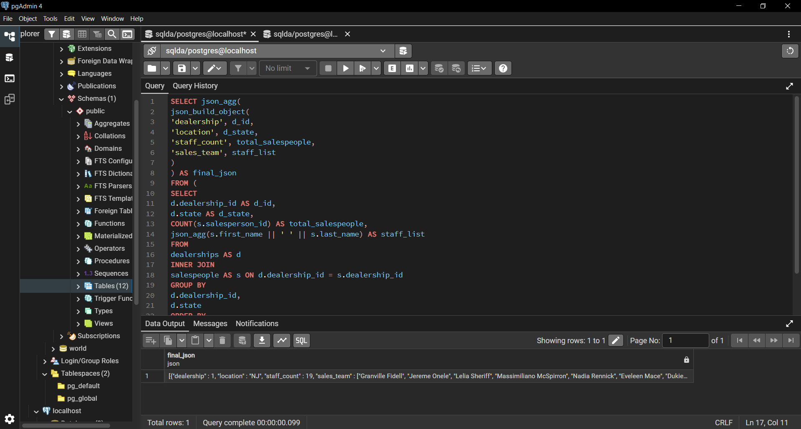

# Exercise 05: SQLDA Database - Dates, Data Quality, Arrays, and JSON

- Name: Megan Chastain
- Course: Database for Analytics
- Module: 05
- Database Used:  `sqlda` (Sample Datasets)
- Tools Used: PostgreSQL (pgAdmin or psql)

---

## Instructions

- Use the **sqlda** database from the "Loading the Sample Datasets" instructions.
- For each SQL task:
  - Include your SQL in a fenced code block
  - Execute it and include a **screenshot** showing the query and results
- Store screenshots in the `screenshots/` folder and embed them below each answer.
- For explanation questions:
  - Write your answer in complete sentences
  - Include a screenshot if requested

---

## Question 1

Using the `sqlda` database, write the SQL needed to show a **list of years** that emails were sent.

Your results should list years like this (order matters):

```
year
2011
2013
2014
2015
2016
2017
2018
2019
```

### SQL

SELECT DISTINCT(EXTRACT(year from sent_date)) AS year
FROM emails
```

### Screenshot


---

## Question 2

Using the `sqlda` database, write the SQL needed to show the **number of messages sent by year**, ordered by year (as shown in the prompt).

Output should resemble:

```
count   year
...
```

### SQL

```sql
Select
	extract('year'from sent_date)
	As year,
	Count(*) as number_of_emails_sent
From emails
group by
    EXTRACT(YEAR FROM sent_date)
Order by year ASC;

```

### Screenshot



---

## Question 3

Using the `sqlda` database, write the SQL needed to show:
- the **sent date**
- the **opened date**
- the **interval** between the two

Only include emails that contain **both** a sent date and an opened date.

### SQL

```sql
SELECT
    sent_date,
    opened_date,
    (opened_date - sent_date) AS response_interval
FROM
    emails
WHERE
    sent_date IS NOT NULL
    AND opened_date IS NOT NULL
ORDER BY
    response_interval DESC;
```

### Screenshot



---

## Question 4

Using the `sqlda` database, write the SQL needed to show emails that contain an **opened date BEFORE the sent date**.

### SQL

```sql
SELECT
    email_id,
    sent_date,
    opened_date
FROM
    emails
WHERE
    opened_date < sent_date;
```

### Screenshot



---

## Question 5

Using the `sqlda` database: there are **over 100 emails** that contain an opened date **BEFORE** the sent date.

After looking at the data, **why is this the case?**

### Answer

Time zones aren't taken into account.

### Screenshot (if requested by instructor)



---

## Question 6

Using the `sqlda` database, explain in your own words what the following code does:

```sql
CREATE TEMP TABLE customer_points AS (
    SELECT
        customer_id,
        point(longitude, latitude) AS lng_lat_point
    FROM customers
    WHERE longitude IS NOT NULL
    AND latitude IS NOT NULL
);

CREATE TEMP TABLE dealership_points AS (
    SELECT
        dealership_id,
        point(longitude, latitude) AS lng_lat_point
    FROM dealerships
);

CREATE TEMP TABLE customer_dealership_distance AS (
    SELECT
       customer_id,
       dealership_id,
       c.lng_lat_point <@> d.lng_lat_point AS distance
    FROM customer_points c
    CROSS JOIN dealership_points d
);
```

### Answer

The code sequence is to show spatial relationships between customers and their closest dealerships.

---

## Question 7

Using the `sqlda` database, write SQL to display an **array of salespeople for each dealership**, sorted by dealership.

For example - dealership 1 is below:

```text
"{""Fidell,Granville"",""Onele,Jereme"",""Sheriff,Lelia"",""McSpirron,Massimiliano"",""Rennick,Nadia"",""Mace,Eveleen"",""Oxteby,Dukie"",""Spong,Marcos"",""Wogden,Quent"",""Duny,Sandye"",""Loraine,Englebert"",""Meere,Ira"",""Gibbens,Cristine"",""Prine,Lyda"",""McCoughan,Sheff"",""Schule,Giselbert"",""McAndie,Eleen"",""Dosedale,Dorie"",""Nafziger,Shay""}"
```

### SQL

```sql
SELECT
dealership_id,
array_agg(first_name || ' ' || last_name ORDER BY last_name) AS salespeople
FROM
salespeople
GROUP BY
dealership_id
ORDER BY
dealership_id;
```

### Screenshot



---

## Question 8

Using the `sqlda` database, write SQL to display:
- an **array of salespeople for each dealership**
- the **state** of the dealership
- the **number of salespeople** for the dealership

Sort by **state**.

Reference image:


### SQL

```sql
SELECT
d.dealership_id,
d.state,
array_agg(s.first_name || ' ' || s.last_name ORDER BY s.last_name) AS salespeople_list,
count(s.salesperson_id) AS salesperson_count
FROM
dealerships d
JOIN
salespeople s ON d.dealership_id = s.dealership_id
GROUP BY
d.dealership_id,
d.state
ORDER BY
d.state;
```

### Screenshot



---

## Question 9

Using the `sqlda` database, write the SQL needed to convert the **customers** table to **JSON**.

### SQL

```sql
SELECT
json_agg(row_to_json(c)) AS all_customers_json
FROM
customers c;
```

### Screenshot


---

## Question 10

Using the `sqlda` database, write SQL to display:
- an **array of salespeople for each dealership**
- the **state**
- the **number of salespeople**
- sorted by **state**

Then **convert this result to JSON**.

Reference image:


### SQL

```sql
SELECT json_agg(
json_build_object(
'dealership', d_id,
'location', d_state,
'staff_count', total_salespeople,
'sales_team', staff_list
)
) AS final_json
FROM (
SELECT
d.dealership_id AS d_id,
d.state AS d_state,
COUNT(s.salesperson_id) AS total_salespeople,
json_agg(s.first_name || ' ' || s.last_name) AS staff_list
FROM
dealerships AS d
INNER JOIN
salespeople AS s ON d.dealership_id = s.dealership_id
GROUP BY
d.dealership_id,
d.state
ORDER BY
d.dealership_id ASC
) AS dealership_data;
```

### Screenshot


